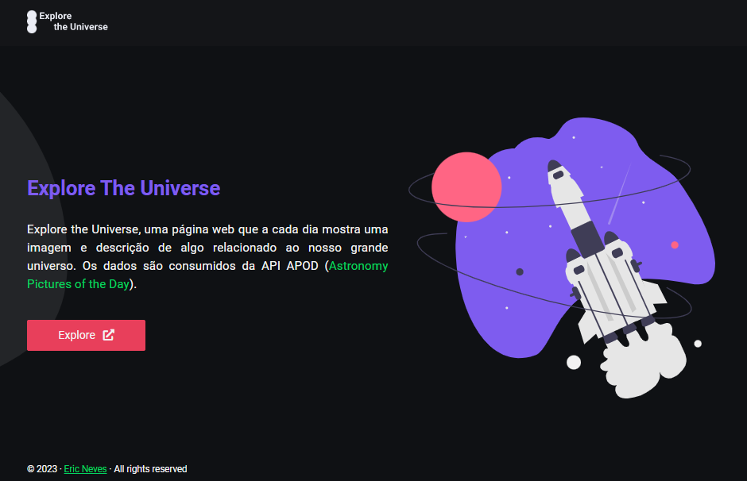
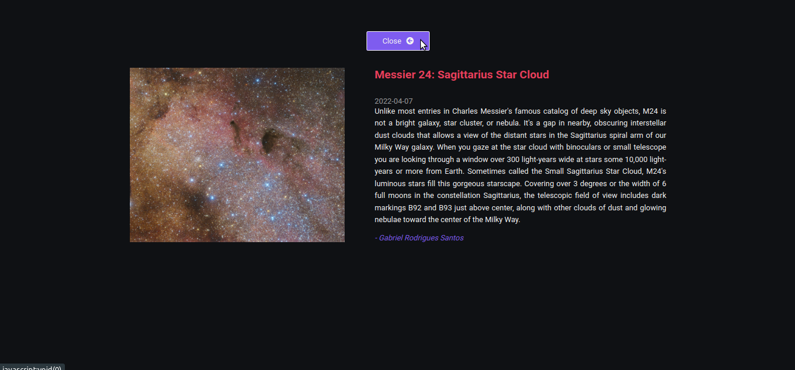

### Explore the Universe


<div>
    
    
</div>

<p>Explore the Universe, uma página web que a cada dia mostra uma imagem e descrição de algo relacionado ao nosso grande universo. Os dados são consumidos da API APOD (<a href="https://apod.nasa.gov/apod/astropix.html" target="_blank">Astronomy Pictures of the Day</a>).</p>


<br/><br/>


### Executando ⚙️

```sh
# Website: https://exploretheuniverse.herokuapp.com/

# Clone
$ git clone git@github.com:EricNeves/exploretheuniverse.git

# Install Dependencies
$ cd exploretheuniverse && npm install

# Execute
$ npm start
# Build
$ npm run build
```

### Ferramentas 🛠

   * HTML5
   * CSS3
   * Javascript
   * NodeJS
     * [Express]('https://expressjs.com/')
     * [GulpJS]('https://gulpjs.com/')

### 📝 License

